# Lab 3

## główny ekran

definicja nawigacji pomiędzy ekranami

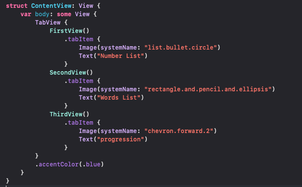

## ekran pierwszy - generowanie i sortowanie 100 losowych liczb

Kod odpowiadający za obłsugę generowania i sortowania listy

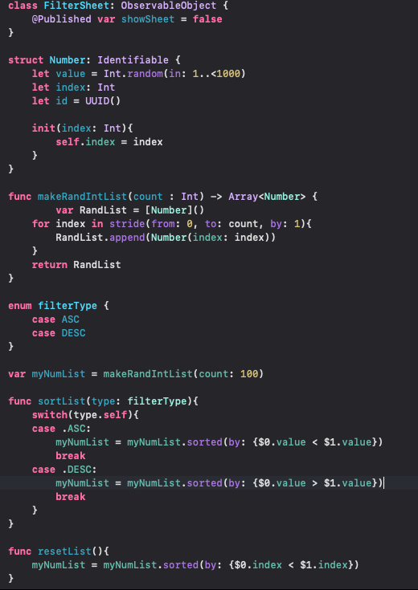

kod widoku ekranu filtrów 
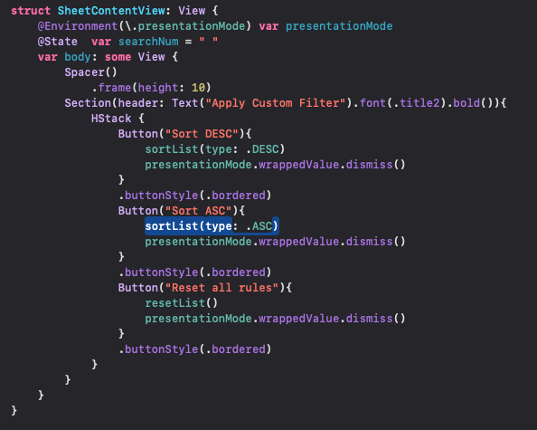

fragment kodu odpowiadający za wyświetlanie widoku z dostepnymi filtrami

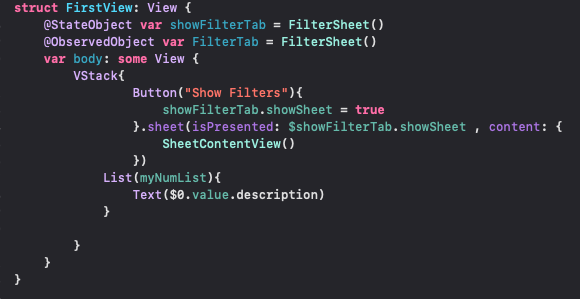

Podstawowy widok listy 

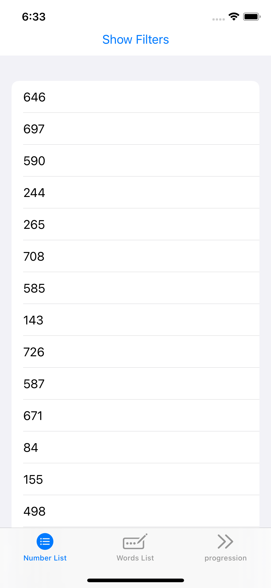

Widok listy filtrów

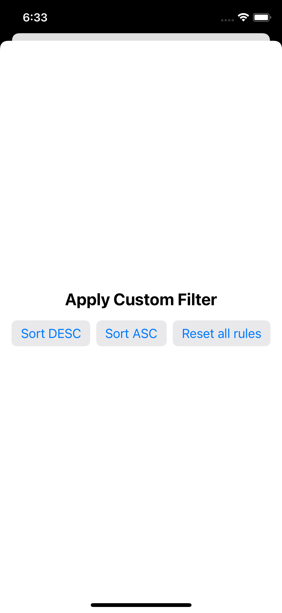

Sortowanie ASC

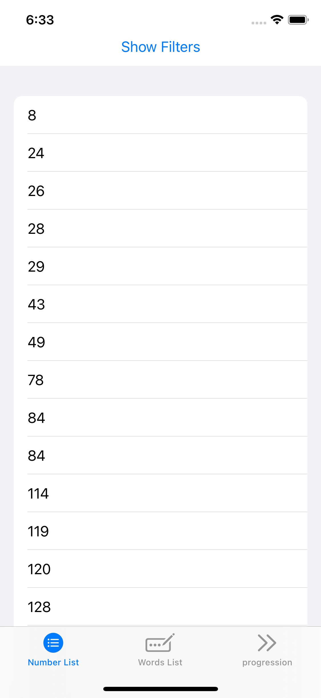

Sortowanie DESC

## Ekran 2 - lazy loading randomowa lista słów

Generowanie randomowej listy

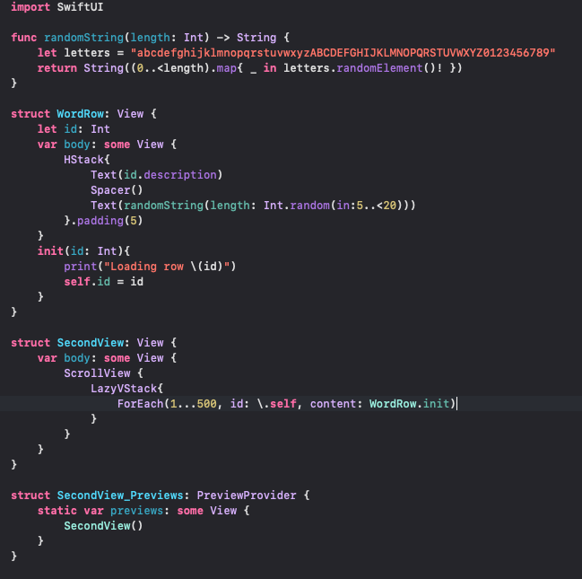

Widok listy oraz ładowania 1

Widok listy oraz ładowania 2

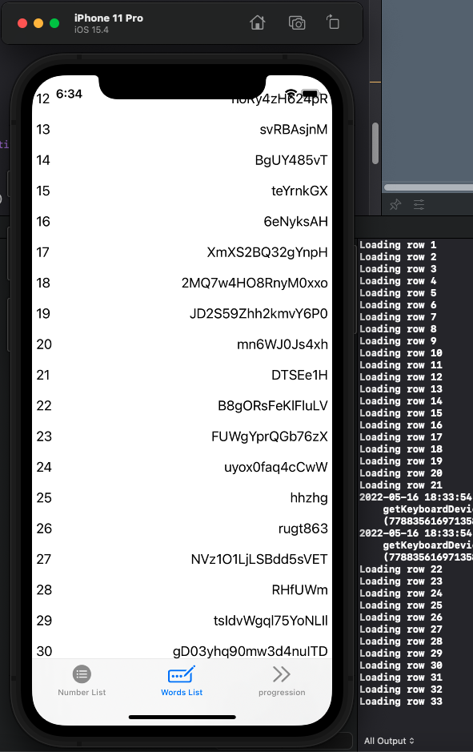

## ekran 3 - step progress

### kod pierwszego ekranu postępu

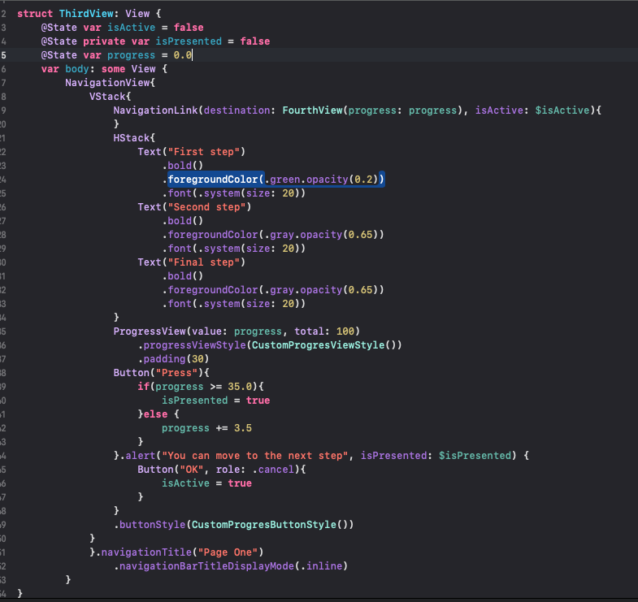

### podgląd pierwszego kroku

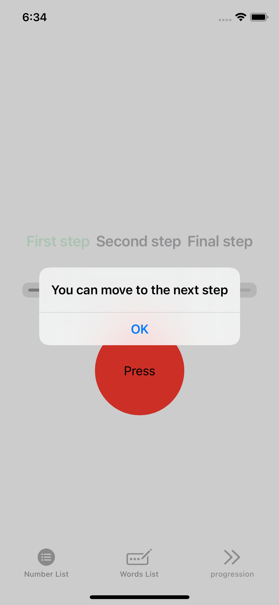

### kod drugiego ekranu postępu

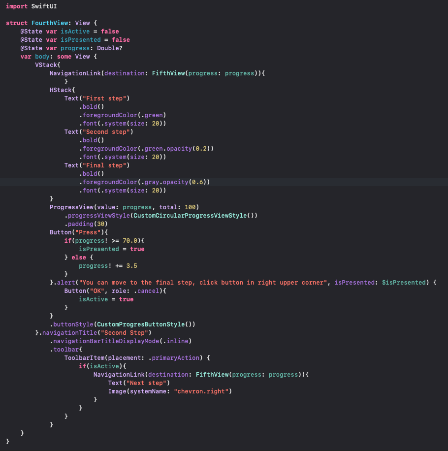

### podgląd drugiego kroku

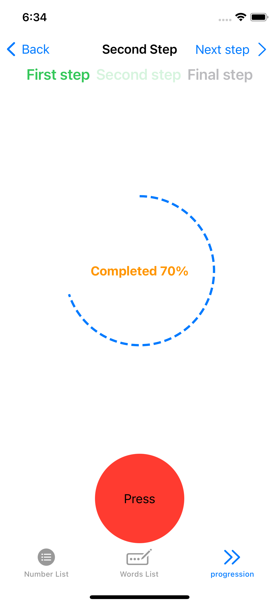

### kod trzeciego ekranu postępu

### podgląd trzeciego ekranu

