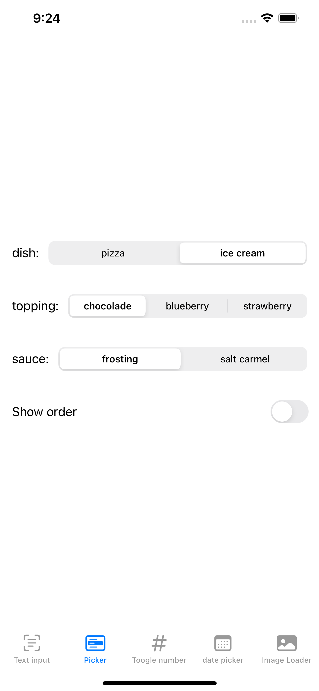

#  Lab 4

## ekran główny zakładki do poszczegółnych kart

## 1 Ekran - pola tekstowe

### Kod tworzący pola tekstowe o roznych właściwościach

### ekran z polami tekstowymi

### ekran z widokiem wypełnionych pól

## 2 ekran - działanie menu select

Definiowanie opcji dostępnych w menu

Wyswietlanie odpowiednich opcji zaleznie do wybranego dania

## Widok początkowego stanu menu po wyborze ice cream i dostępnych dla niego opcji

##  Widok po zmienie z dania ice cream na pizza

## Widok opcji dostępnych dla dania pizza i wyświetlenie zamówienia

## 3 ekran - Wyświetlanie losowej liczby za pomocą elementu toggle

Przy kliknięciu przycisku toggle zostaje wygenerowana losowa liczba i wyświetlana na ekranie

 Widok po "włączeniu" przycisku toggle

### 4 ekran - wybór daty i powiadomienie

Stworzenie DatePickera oraz uzycie przycisku i  widoku Alert do wyświetlania wybranej daty z poprawnym formatowaniem

### Widok wyboranej daty przed wyswietleniem alertu

### Widok po przyciśnięciu przycisku display date

##  4 ekran - powiadomienie toast i wyswietlanie obrazka

### kod odpowiadający za ładowanie obrazka po wciśnieciu przycisku, informując uzytkownika o aktualnym statusie zadania za pomocą powiadomień toast

Widok początkowy ekranu

Wyświetlanie powiadomienia o rozpoczeciu ładowania obrazu

Wyświetlenie obrazka oraz 

