# Lab 5

## 1 Ekran - scrollView

Kod ekranu pierwszego implementujacego listę 100 elementów w widoku scrollView

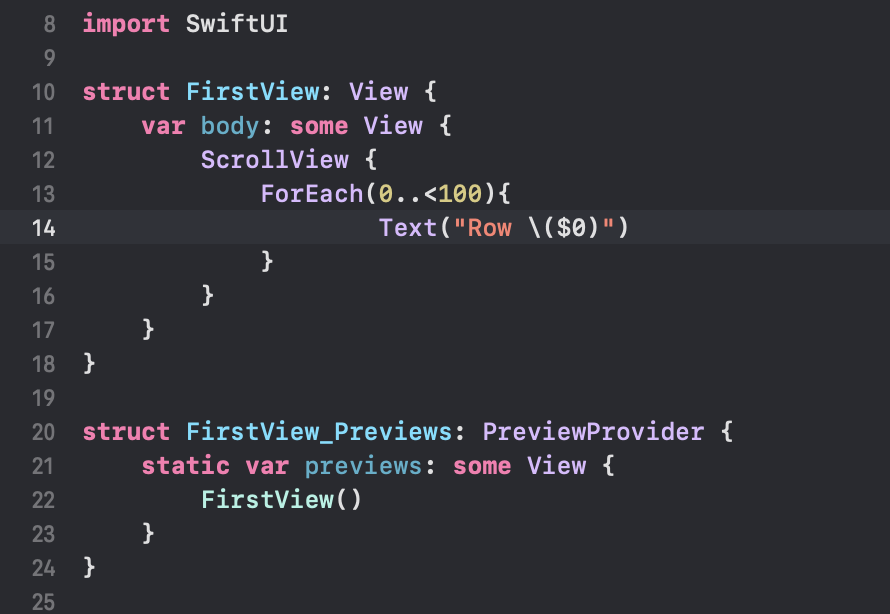

Widok przesuwanej listy

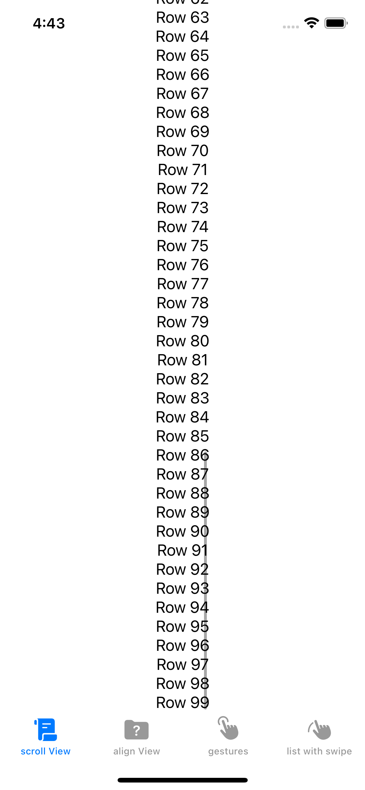

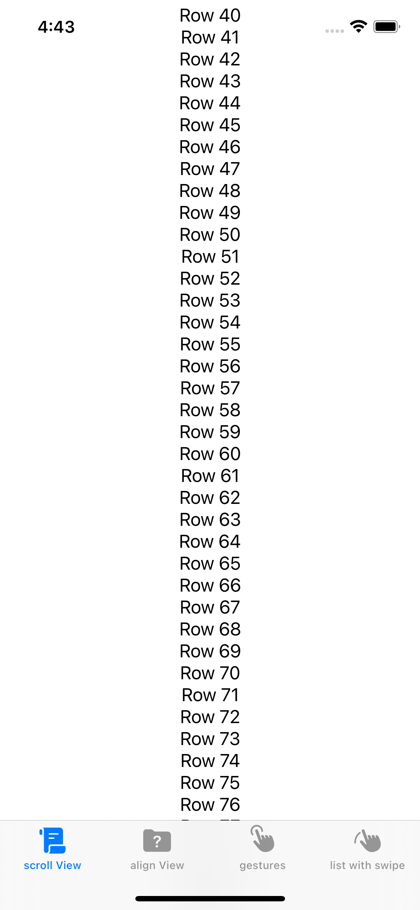

## 2 Ekran - pozycjonowanie elementów

Napisałem implementację widoków ZStack, VStack, HStack oraz ScrollView

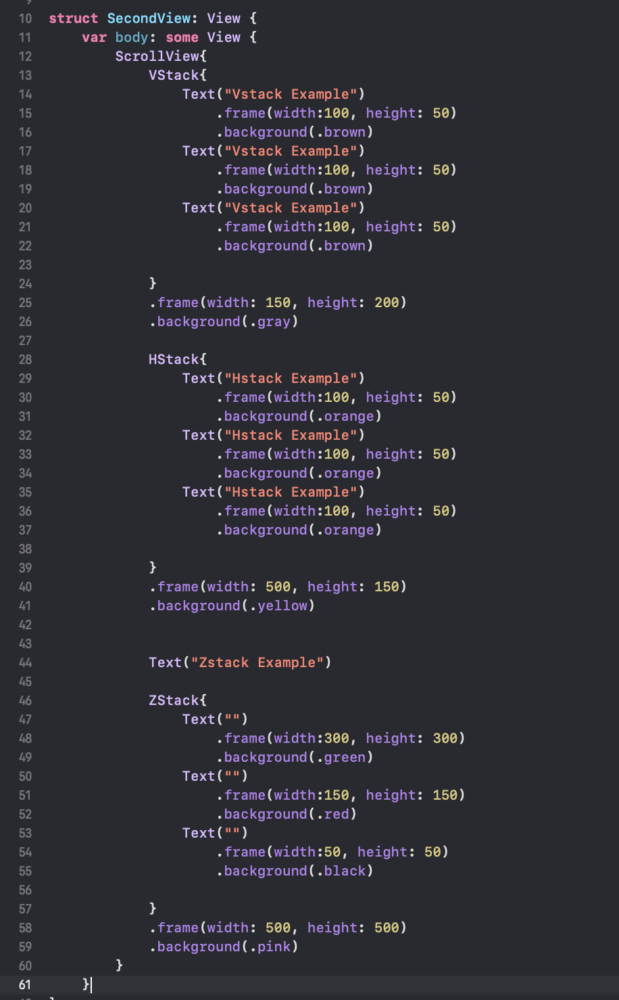

Widok ekranu

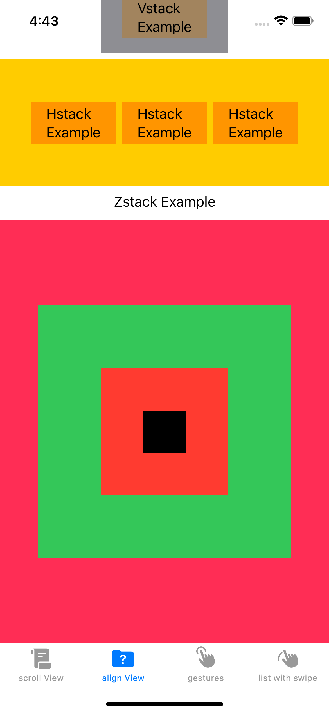

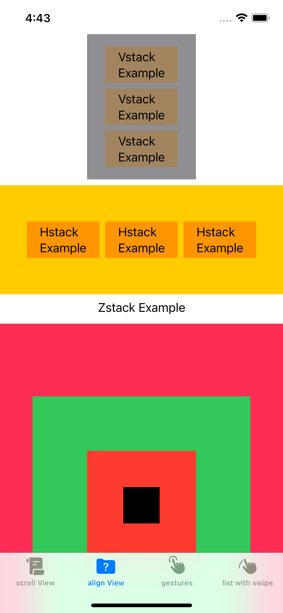

## 3 Ekran - Gesty

Jako, ze nie znalazłem obsługi gestów wymienionych w zadaniu prezentuje działanie gestów resizable, onLongPress oraz na double tap.

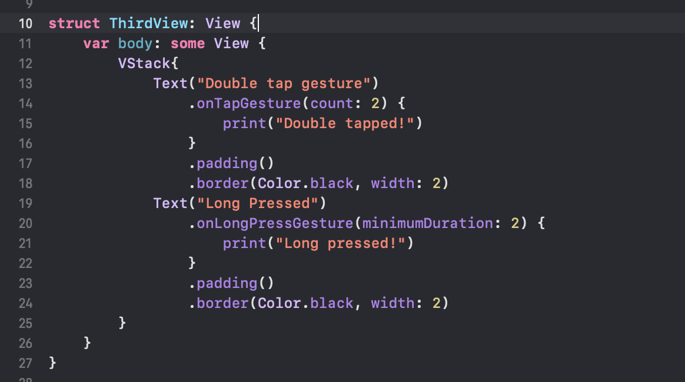

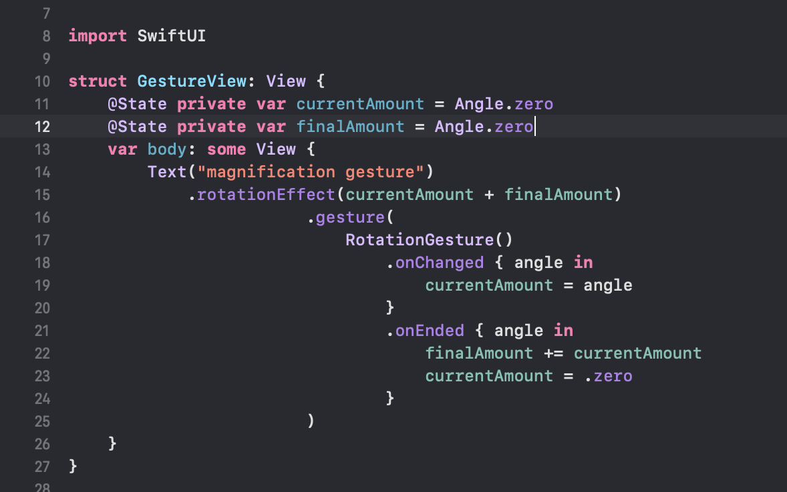

Widok gestów

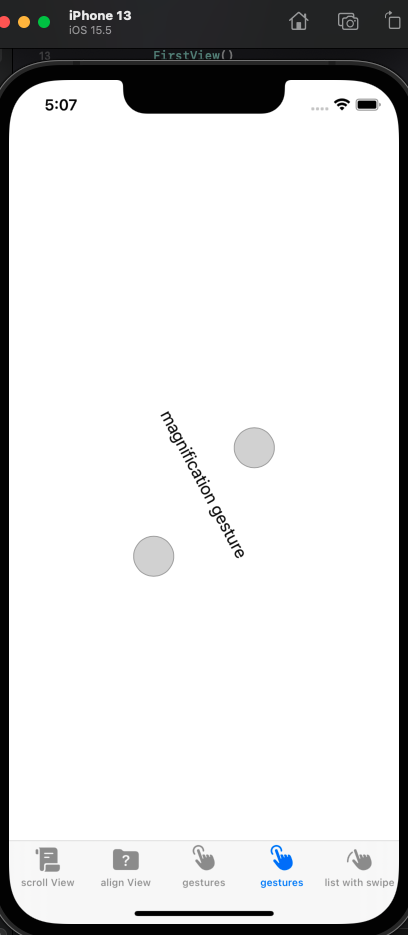

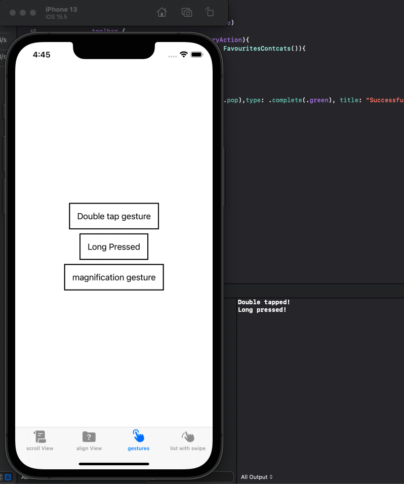

## 4 Ekran - swipeable gesture

Zaimplementowałem gest swipeable w formie ulubionych kontaktów. Po przesunieciu danego kontaktu pokazuje się ikona gwiazdki, która po kliknięciu dodaje wybrany kontakt do listy ublionych oraz wyświetla powiadomienie toast. Ulubione kontakty mozna zobaczyć w osobnym widoku.

definicja struktury kontakt oraz jego obiektu:

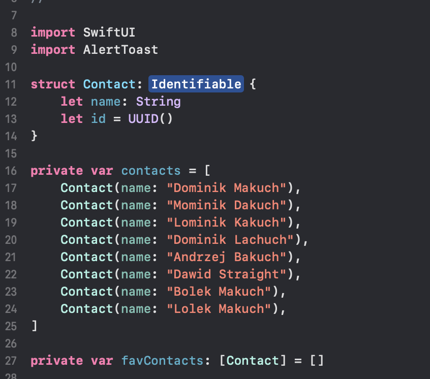

widok odpowiadających za wyświeltanie ulubionych kontaktów

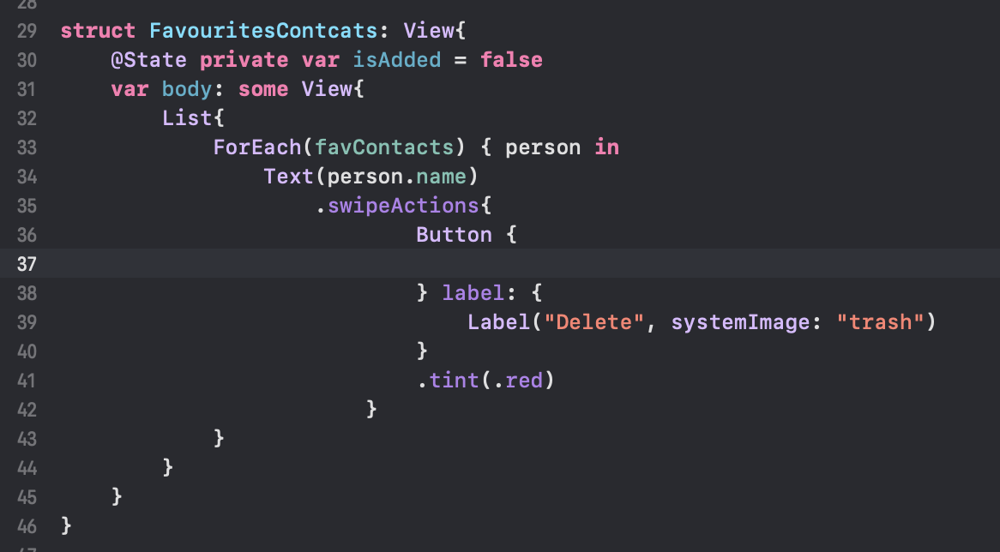

wyświetlanie listy kontaktów, definicja gestu przesuwania, oraz powiadomienia toast

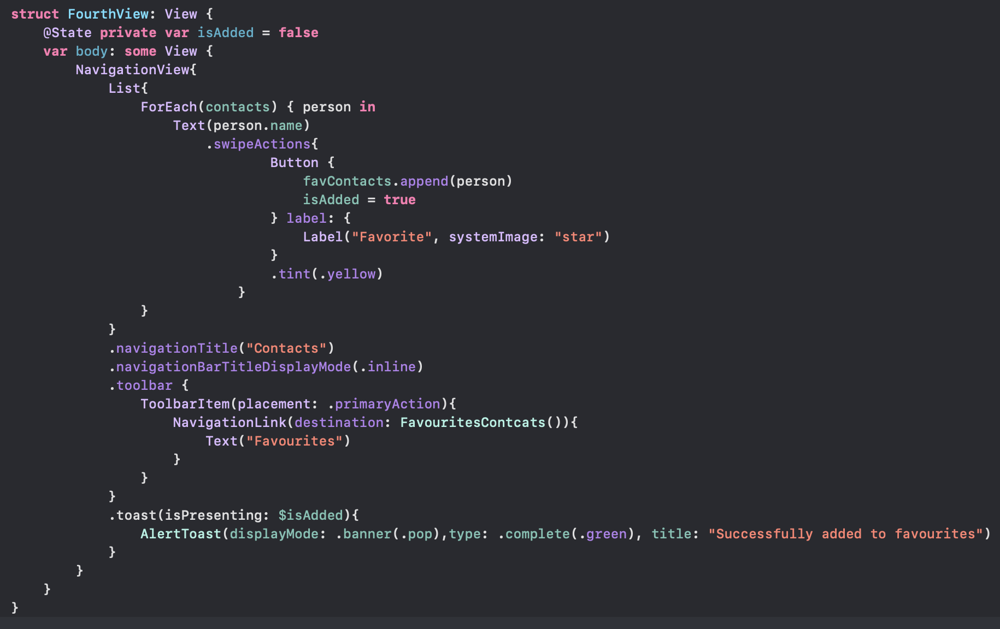

Widok listy kontaktów

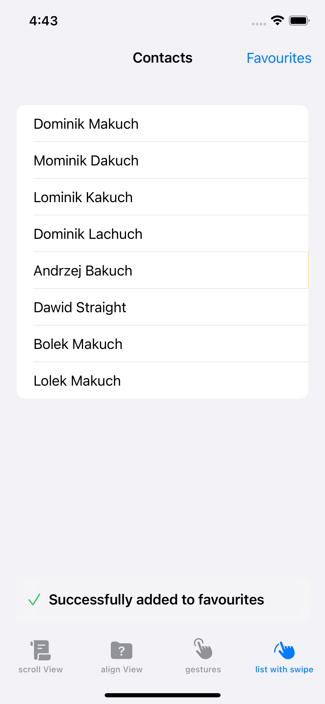

Widok po przesunięciu

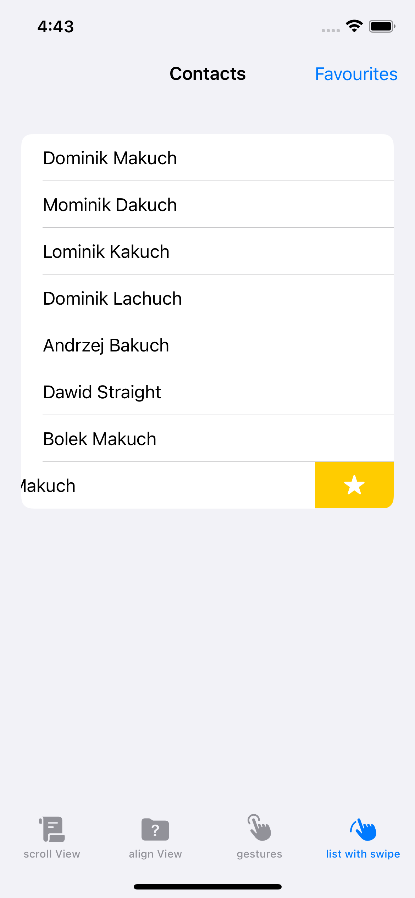

Pomyślne dodanie do ulubionych, wyświetlenie powiadomienia

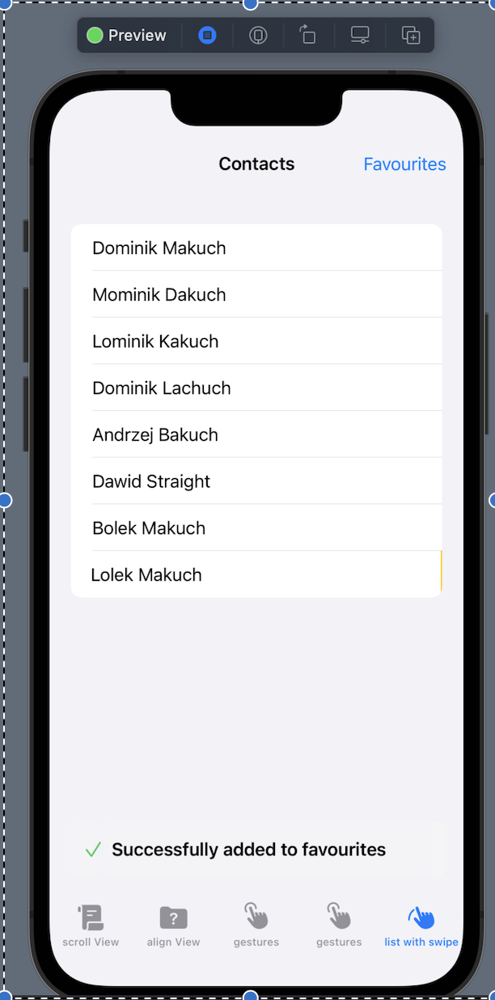

Wyświetelenie listy ulubionych kontaktów

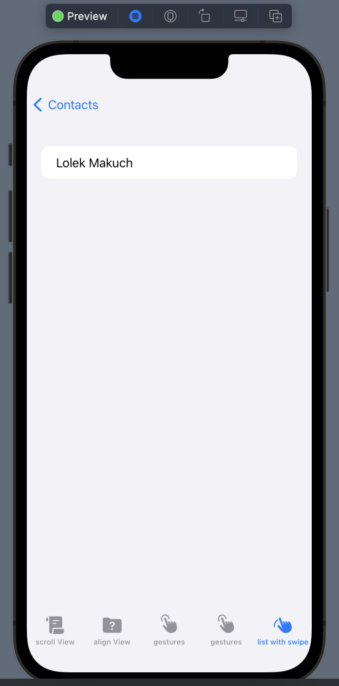
