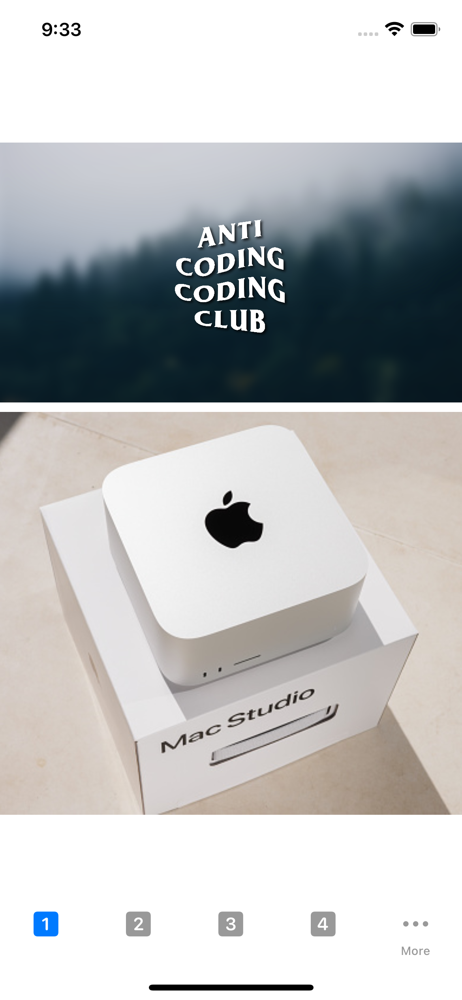
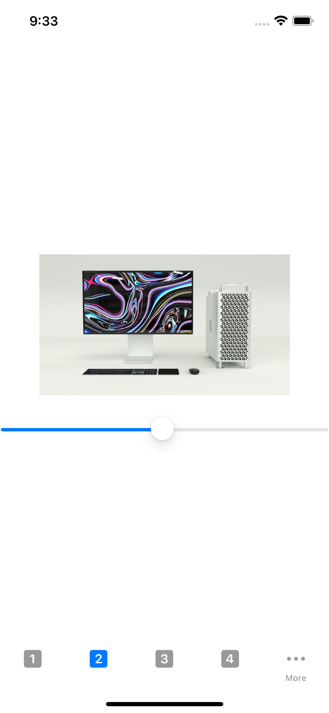

# Lab 6

## Ekran 1 - ładowanie obrazków

Kod ładujcy dwa obrazki, jeden lokalnie, a drugi z linka za pomocą asyncImage.

## Ekran 2 - slider

Kod ładuje obrazek z pliku, slider umożliwia zmienianie rozmiaru obrazka

## Ekran 3 - ikony i lazy loading

Ikony zostały załadowe z bazy sf symbols dosępnych na platofrmie ios. Lazy loading zostało zaimplementowane za pomocą WebImage.

## Ekran 4 - sprawdzanie połączenia

W tym celu wykorzystałem bibliotekę Reach która zwraca status połączenia z siecią w postaci enum. 

## Ekran 5 - zapis do lokalniej bazy danych

Nie udało mi się znaleść odpowiednika AsyncStorage dla natywnego IOSa dlatego wykonałem ekran gdzie zapisuje listę zadań do lokalnej bazy danych za pomocą biblioteki Realm

## Ekran 6 - status połączenia

Wykonuję zapytanie do api, które zwraca losowe żarty z chuckiem norrisem, po każdym zapytaniu żart jest zapisany lokalnie, jeśli utracimy połączenie z internetem zostanie wyświetlona stosowna wiadomość, wcześniej wyświetlone żarty są nadal dostępne.

