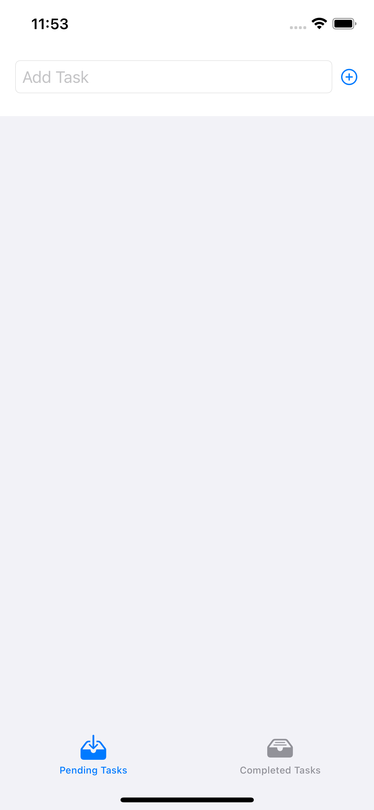
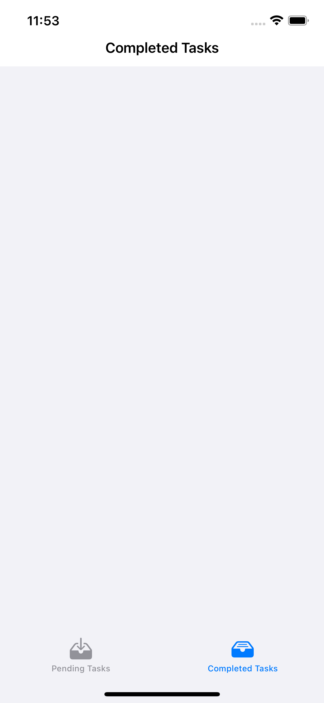
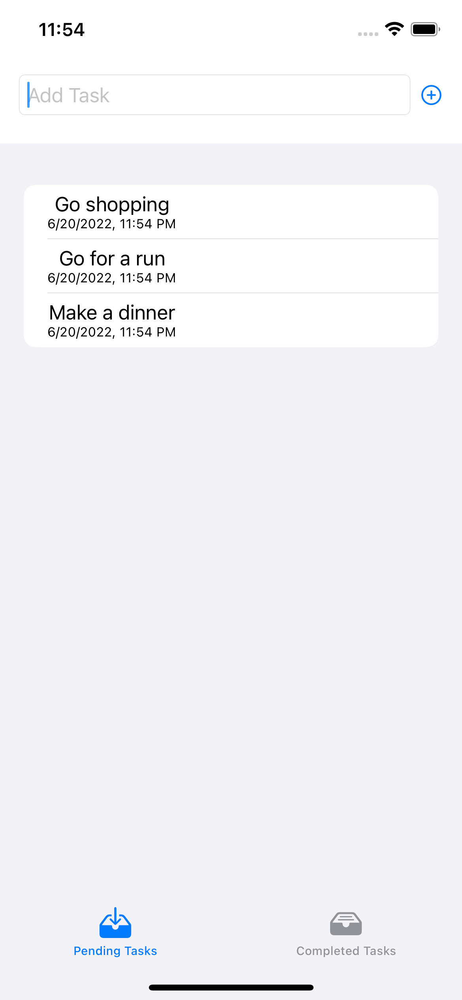
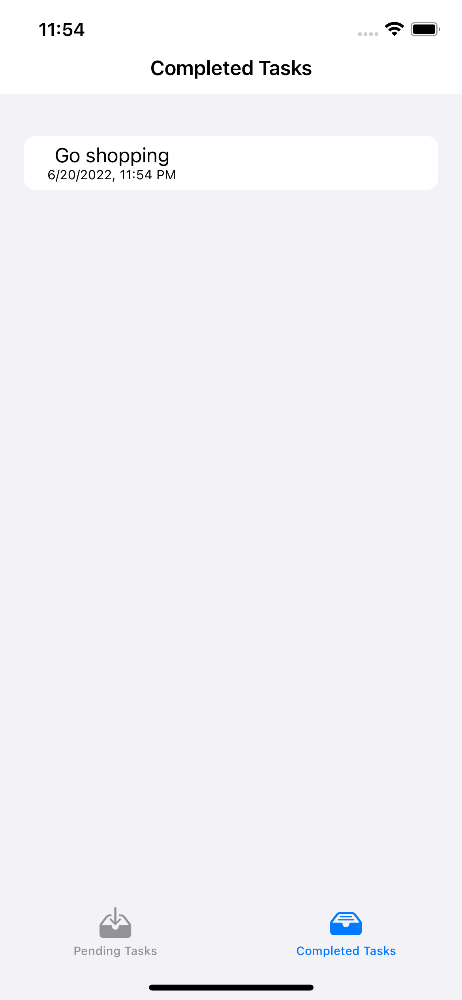
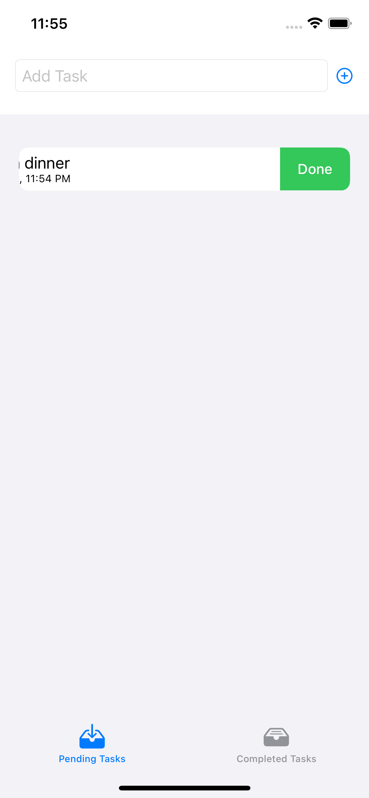
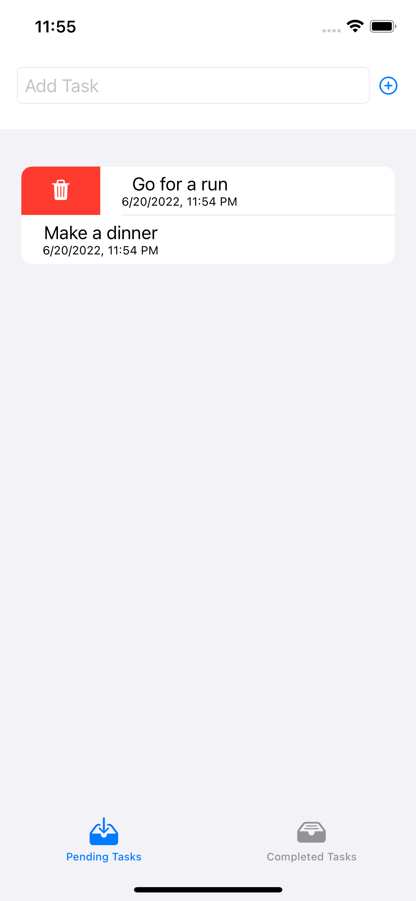

#  Lab 7 - ToDoList

Aplikacja korzysta z frameworku Core Data, zdefiniowałem sobie model Task o następujących atrybutach: id, isDone, name, date. Appka ma dwa ekrany, jeden z otwartymi zadaniami oraz polem dodawania nowego zadania i widok listy zakończonych zadań. Kazde zadanie ma zdefiniowane gesty po przeciągnieciu w lewo mozna usunac zadanie z listy, w prawo mozna oznaczyc zadanie jako wykoanane, wtedy pojawi sie na liscie ukonczonych zadan. Podczas pierwszego uruchomienia aplikacji zostaje utworzona baza danych, poźniej przy kazdym kolejnym uruchomieniu apki odczytuje ona z niej informacje.

## Początkowy stan kazdego z ekranow, brak zadnych dodanych taskow.

## Dodanie nowego zadania

## Widzimy zadanie wcześniej oznaczone jako ukończone pojawiło się w drugim widoku

## Screeny pokazujące gesty którymi mozemy usuwac zadania oraz  oznaczac je jako ukonczone

