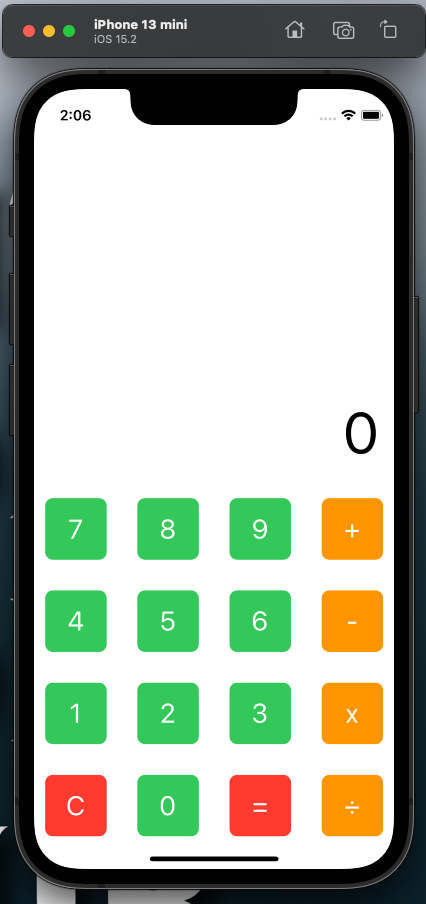
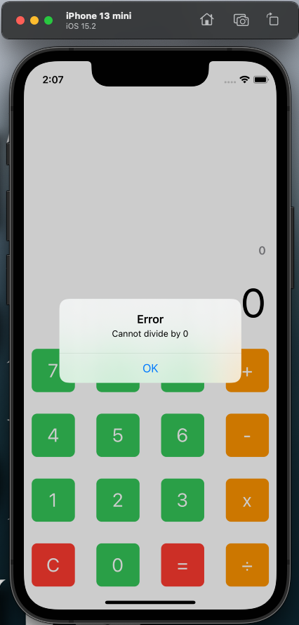
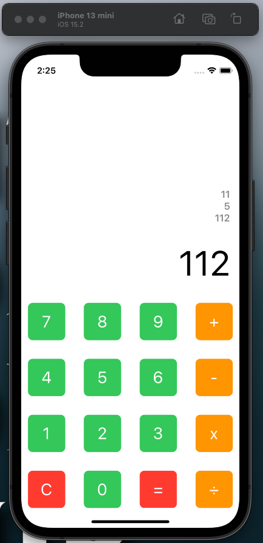
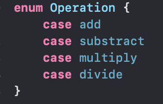
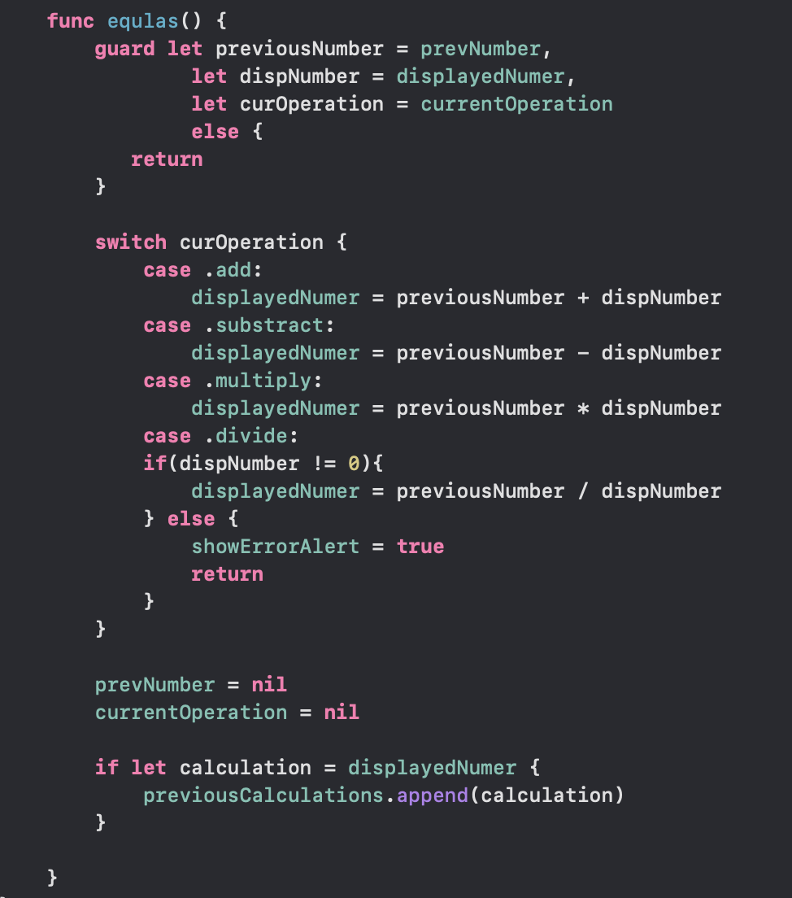
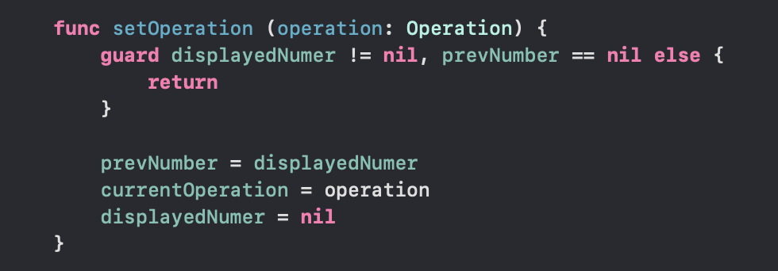
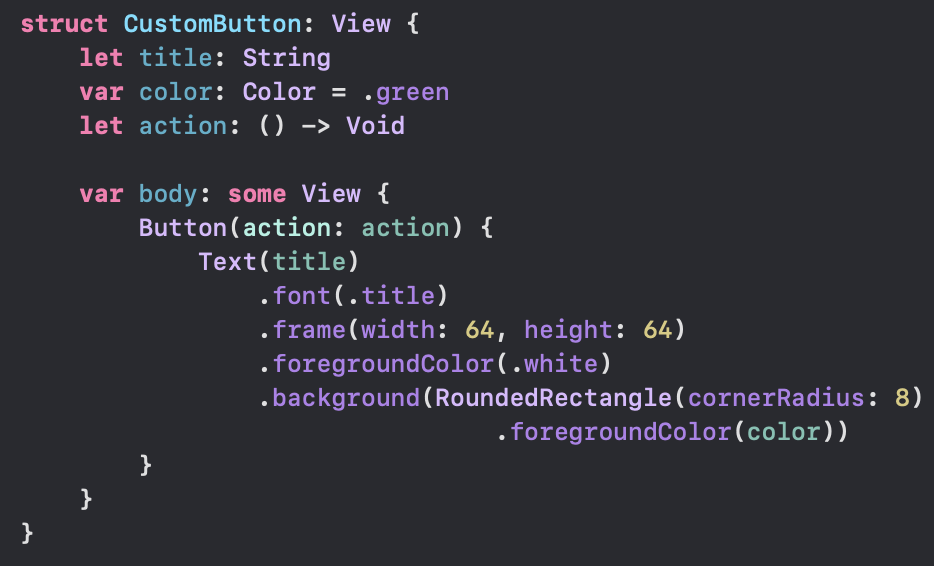
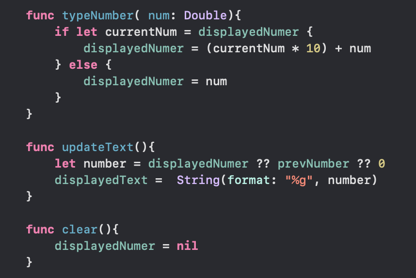
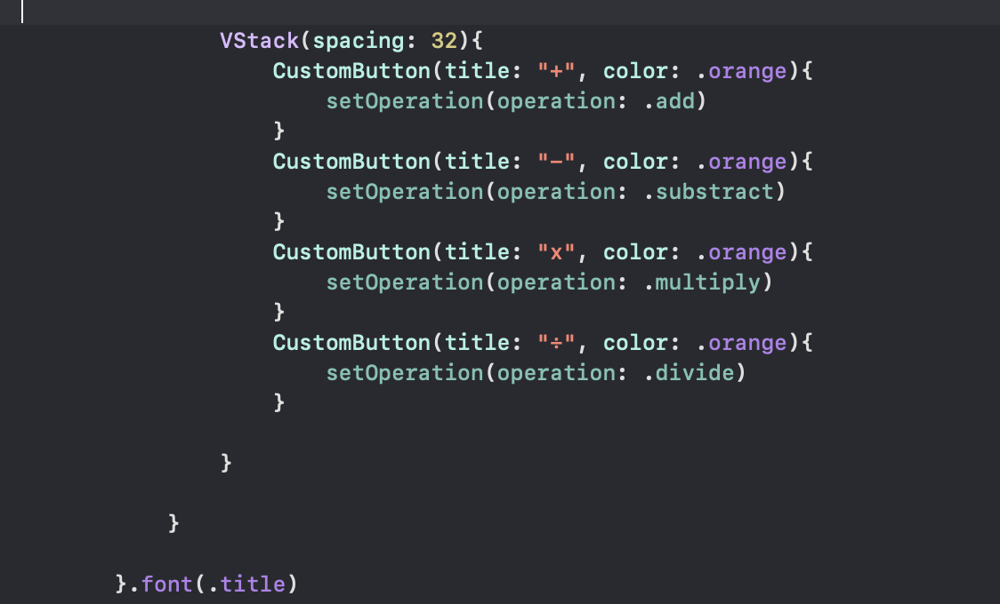
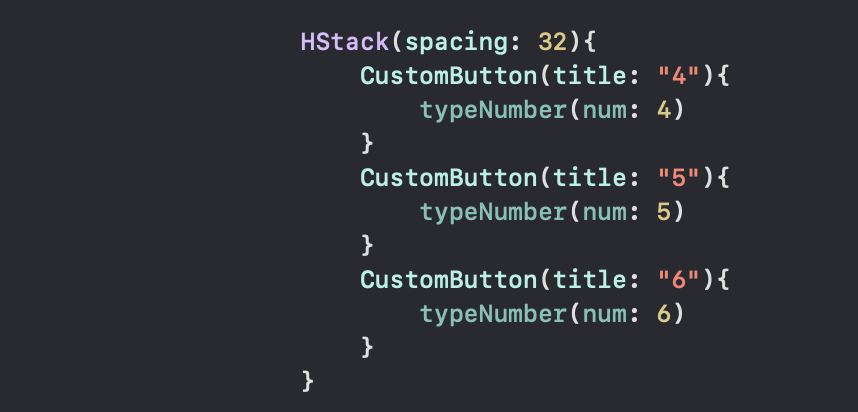

#  Labolatorium nr 1 - aplikacje mobilne

### kalkulator

## Screeny z aplikacji

## Opis użytych Komponentów

Do obliczania, wprowadzania liczb, czyszczenia historii działań stworzyłem stosowne funkcje. Działania są wykonywane na podstawie funkcji switch. typy operacji są typu enum. Przy dzieleniu przez zero aplikacja wyswietli stosowny komunikat. Poniżej implementacja ww funkcji:

## Wyświetlanie przycisków

Za pomocą VStack i HStack pogrupowałem wszystkie przyciski w tabelę 4 na 4. Swrozyłem personalizowany okrągły przycisk w strukturze CustomButton, który potem został użyty przy wszystkich przyciskach.

Struktura CustomButton

Wyświetlanie wyniku i historii

Przykładowa kolumna  przycisków

Przykładowa kolumna  przycisków

